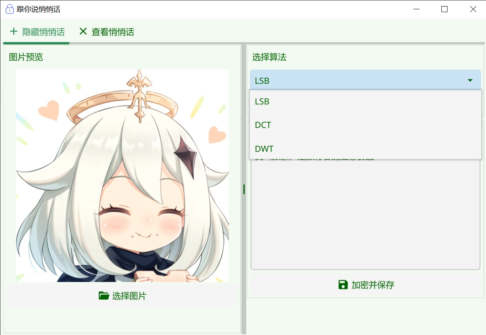
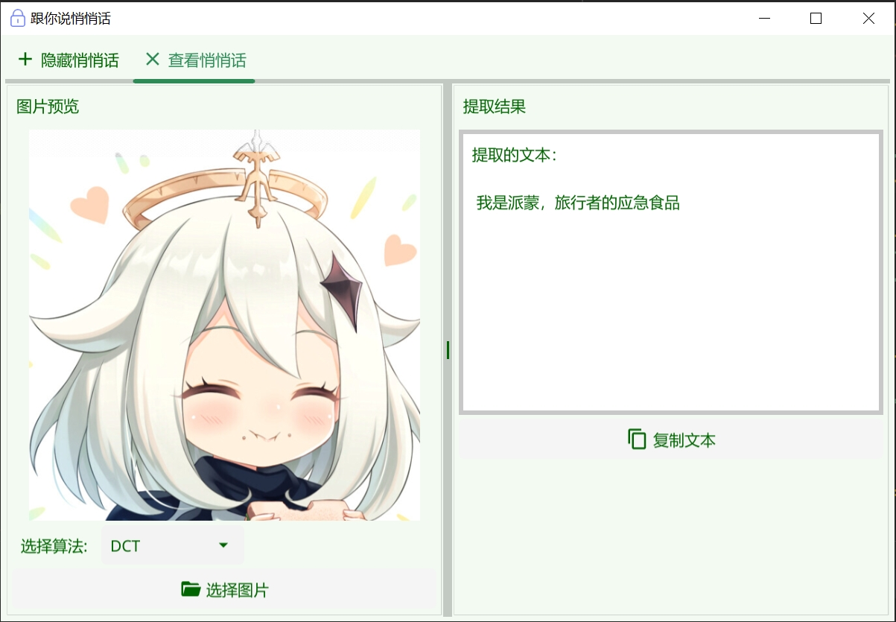

# 跟你说悄悄话 - 图像隐写工具

一个简单易用的图像隐写工具，支持多种隐写算法，可以将文本信息隐藏在图片中。

## 功能特点

- 支持多种隐写算法：
  - LSB（最低有效位）
  - DCT（离散余弦变换）
  - DWT（离散小波变换）
- 直观的图形用户界面
- 实时显示可嵌入文本容量
- 自动图像预处理
- 支持中文和特殊字符
- 一键复制提取的文本

## 界面预览

### 加密界面

### 解密界面

## 使用说明

### 加密步骤
1. 选择要使用的隐写算法（LSB/DCT/DWT）
2. 点击"选择图片"上传待处理的图片
3. 在文本框中输入要隐藏的信息
4. 点击"加密并保存"将处理后的图片保存到本地

### 解密步骤
1. 选择要使用的隐写算法
2. 点击"选择图片"上传包含隐藏信息的图片
3. 自动提取并显示隐藏的文本
4. 可以使用"复制文本"按钮复制提取的内容

## 算法说明

### LSB（最低有效位）
- 将文本信息嵌入图片像素的最低位
- 具有最大的嵌入容量
- 视觉效果变化最小

### DCT（离散余弦变换）
- 在频域中嵌入信息
- 具有较好的抗干扰能力
- 要求图片尺寸为8的倍数

### DWT（离散小波变换）
- 利用小波变换的高频系数嵌入信息
- 具有良好的隐蔽性
- 要求图片尺寸为2的幂

## 注意事项

1. 图片预处理：
   - DCT算法会自动裁剪图片至8的倍数
   - DWT算法会自动裁剪图片至2的幂大小
   - LSB算法无特殊要求

2. 文本容量：
   - 不同算法的最大嵌入容量不同
   - 界面会实时显示当前可用容量
   - 超出容量会有警告提示

3. 图片格式：
   - 支持PNG、JPG、JPEG格式的图片
   - 建议使用PNG格式保存处理后的图片

## 开发技术

- 使用Go语言开发
- GUI框架：Fyne
- 图像处理：Go标准库 image
- 数据处理：自定义steganography包

## 许可证

[GNU GENERAL PUBLIC LICENSE](LICENSE)